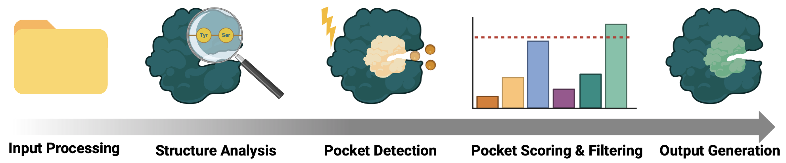

[](Tutorial.ipynb)
[](Analysis.ipynb)
[](Theory.ipynb)
 


# ConSBind: Consensus Structural Binding Site Predictor

ConSBind is a Python package for predicting protein binding sites using a consensus of geometric and energy-based approaches. The tool identifies potential binding pockets in protein structures and scores them based on multiple complementary criteria, with an intuitive and user-friendly interface.

## Features

- Detection of protein binding sites using geometry and energy-based methods
- Consensus scoring to improve prediction reliability
- Knowledge-based filters to identify pockets 
- Ability to customize prediction parameters for different protein types
- Output in standard PDB format with visualization support for PyMOL and UCSF Chimera
- Automatic handling of both PDB and ENT file formats
- Batch processing of multiple protein structures

## Binding Site Scores

ConSBind uses several score metrics:

1. **Consensus Score**: Measures agreement between different detection methods
2. **Binding Potential Score**: Composite score combining consensus and pocket characteristics
3. **Druggability Score**: Estimates the pocket's suitability for small molecule binding
4. **Knowledge-based Score**: Based on known binding site residue patterns

## Methodology

ConSBind implements a pipeline for binding site identification that combines multiple complementary computational techniques to improve prediction accuracy.



Mainly; pocket detection, scoring and filtering combines multiple approaches to binding site identification:

1. **Geometric**: Identifies cavities and pockets in the protein structure
2. **Energy-based**: Evaluates the physicochemical properties of potential binding regions
3. **Knowledge-based**: Applies known patterns of binding site composition and architecture

The final predictions represent a consensus of these approaches, ranked by a combined score that prioritizes consistent pockets detected by multiple methods.

## Installation

```bash
# Clone the repository
git clone https://github.com/claudiavicente/ConSBind
cd ConSBind

# Make sure you have the latest pip and setuptools:
pip install --upgrade pip setuptools wheel

# Install the package
pip install -e . --config-settings editable_mode=compat
```

## Dependencies

- Python 3.6+
- NumPy
- SciPy
- BioPython
- scikit-learn
- tqdm
- colorama
- DSSP (mkdssp binary needs to be in PATH)

### Installing DSSP

DSSP is required for surface calculations. Install it using one of the following methods:

```bash
# On Linux
sudo apt-get install dssp

# On macOS
brew install brewsci/bio/dssp

# Using conda (any platform)
conda install -c salilab dssp
```

Alternatively, you can build DSSP from source:
https://github.com/PDB-REDO/dssp

After installation, ensure the `mkdssp` binary is in your PATH or create a symlink called `mkdssp` that points to the DSSP executable:

```bash
# Example if the DSSP binary is named 'dssp'
sudo ln -s $(which dssp) /usr/local/bin/mkdssp
```

## Usage

### Basic Usage

```bash
# Process a single PDB file
consbind protein.pdb

# Process a directory containing multiple PDB files
consbind my_proteins/
```

ConSBind automatically detects whether the input is a single file or a directory and processes accordingly. It also automatically converts .ent files to .pdb format if needed.

For each processed protein, ConSBind generates:
- `results/protein/protein_predictions.txt` - List of predicted binding sites and residues
- `results/protein/protein_predicted.pdb` - Modified PDB file with binding sites
- `results/protein/protein_pymol.pml` - PyMOL script for visualization
- `results/protein/protein_chimera.cmd (and .bild)` - UCSF Chimera script for visualization

### Advanced Options

```bash
consbind protein.pdb --protein_type enzyme --generate_chimera False
```

Available options:
| Option                | Description                                              | Default           |
|-----------------------|----------------------------------------------------------|-------------------|
| `--output_dir`       | Output directory                                         | results          |
| `--min_size`         | Minimum pocket size                                      | 5                |
| `--probe_radius`     | Probe radius for cavity detection                        | 1.4              |
| `--grid_spacing`     | Grid spacing for energy calculations                     | 1.0              |
| `--score_threshold`  | Minimum score threshold                                  | 3.0              |
| `--consensus_threshold` | Minimum consensus score                               | 1.5              |
| `--protein_type`     | Type of protein: enzyme, transporter, receptor, or unknown | unknown          |
| `--generate_pymol`   | Generate PyMOL visualization script                      | True             |
| `--generate_chimera` | Generate UCSF Chimera visualization script               | True            |

## Visualization

### PyMOL Visualization

To visualize the results in PyMOL:

```bash
pymol results/protein/protein_pymol.pml
```

### UCSF Chimera Visualization

```bash
chimera results/protein/protein_predicted.pdb results/protein/protein_chimera.cmd
```

## License

This project is licensed under the MIT License - see the LICENSE file for details.
